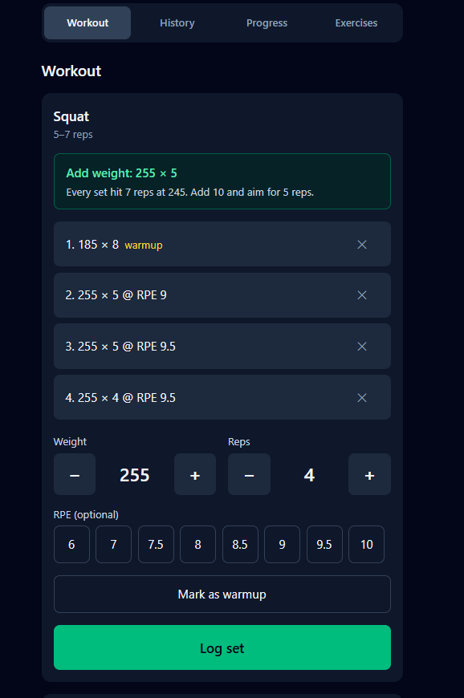
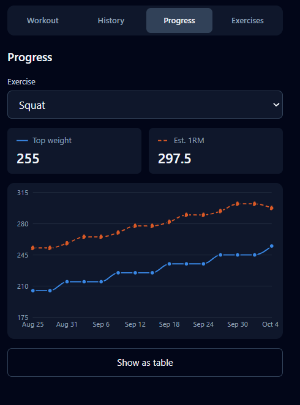

# ProLog

A mobile-first workout logger that tells you what to do next session. Log your sets, and ProLog uses your history to recommend whether to **add weight**, **stay and add reps**, or **deload**, with a plain-English reason every time.

**Live app:** https://LIVE-URL-HERE

<p>
  
  &nbsp;
  
</p>

## Features

- **Recommendations for every exercise**, based on double progression (rules below)
- **Fast logging at the gym**: large +/- steppers for weight and reps, optional RPE, warmup sets
- **Survives a locked phone**: an in-progress workout resumes after a reload
- **History**: past workouts with notes and sets grouped by exercise, editable and deletable
- **Progress charts**: top weight and estimated one-rep max over time, with a table view
- **Private by design**: each user can only ever read or change their own data, enforced in the database

## How recommendations work

ProLog uses **double progression**: keep the weight fixed and work up through a rep range, then add weight and start again at the bottom of the range. Each exercise has a rep range (for example 8–12) and a weight increment (for example 2.5).

Only **working sets at the session's top weight** count. Warmups and lighter back-off sets are ignored.

| Situation | Recommendation |
|---|---|
| Every set reached the top of the rep range, and no set was RPE 9.5 or higher | **Add weight**: add the increment, aim for the bottom of the range |
| Fell short of the bottom of the range **this session and the previous one** at the same weight | **Deload**: drop about 10% (rounded to the increment, at least one increment), aim for the bottom of the range |
| Anything else | **Same weight**: aim for one more rep than your weakest set (capped at the top of the range) |
| No working sets logged yet | No recommendation; log a first session |

Two details that matter in practice:
- **A missing RPE never blocks an increase.** Not logging RPE is treated as "not too hard".
- **The current workout is excluded** when calculating, so the target doesn't shift while you're mid-session.

The rules live in [`src/domain/progression.ts`](src/domain/progression.ts) as a pure function with no React or database code, and are covered by unit tests.

## Tech stack

| Area | Choice |
|---|---|
| Frontend | React 19, TypeScript (strict), Vite |
| Styling | Tailwind CSS v4 |
| Backend | Supabase: Postgres, Auth, Row Level Security |
| Charts | Recharts (lazy-loaded, see below) |
| Testing | Vitest, React Testing Library |
| Hosting | Vercel (free tier) |

It costs nothing to run: Supabase's free tier, a static frontend, and no custom server.

## Architecture

```
src/
  lib/supabase.ts   Supabase client; fails fast with a clear error if env vars are missing
  types/            Database types generated by the Supabase CLI
  api/              Typed data-access functions: the ONLY code that talks to Supabase
  domain/           Pure logic: progression rules, history grouping, 1RM estimates
  features/         One folder per screen: auth, workout, history, progress, exercises
  components/       Shared UI: Stepper, SetForm
supabase/
  migrations/       SQL schema, constraints and RLS policies, version-controlled
```

- **Screens never call Supabase directly.** They go through `api/`, which converts database rows (`rep_min`) to app types (`repMin`). Component tests mock one `api/` module instead of the database client.
- **`domain/` is pure TypeScript**, so the logic that matters most is tested without mocks.

## Security model

The browser talks to Postgres directly through Supabase, using a **public anon key** that ships in the JavaScript bundle. That key is not a secret, and doesn't need to be: **Row Level Security** is what protects the data.

- **Every table has a `user_id` column and RLS enabled.** Each has four policies (select, insert, update, delete), all of the form `auth.uid() = user_id`. Signed-out visitors match no policy and see nothing.
- **`user_id` defaults to `auth.uid()`** in the database, so the client never sends it. The insert and update policies also reject any attempt to set it to someone else's id.
- **Database constraints back up the UI's validation**: positive reps, non-negative weight, RPE between 6 and 10, a minimum rep count no higher than the maximum, and unique exercise names per user. Bad data is rejected even if someone bypasses the UI.
- **Deletes cascade**: deleting a workout removes its sets, and deleting an account removes everything the account owns.
- The **service-role key**, which bypasses RLS, is never used in frontend code.

The policies were checked against a local Postgres by signing in as two users and confirming that neither could read, change or delete the other's rows. The full schema is in [`supabase/migrations/`](supabase/migrations/).

## Data model

```
exercises  id, user_id, name, rep_min, rep_max, increment
workouts   id, user_id, performed_at, notes
sets       id, user_id, workout_id → workouts, exercise_id → exercises,
           set_order, reps, weight, rpe (nullable, 6–10), is_warmup
```

Weights are stored as `numeric` rather than floating point, so values like 2.5 or 1.25 are exact.

## Design decisions

- **The active workout is remembered on the device.** Phone browsers often reload a tab after the screen locks. Sets are saved to the database as they're logged, and the workout's id is kept in `localStorage` so it resumes. A workout more than 6 hours old isn't resumed, so a forgotten "Finish" doesn't put next week's sets on an old date.
- **Concurrent saves can't overwrite each other.** State updates are computed from the latest state (`setState(current => …)`), so two sets saved at nearly the same time are both kept.
- **History is one request per page.** A single nested query fetches workouts, their sets and exercise names together, and paging uses an offset rather than a page number so it stays correct after a workout is deleted.
- **The chart library is lazy-loaded.** Recharts nearly doubled the bundle, so the Progress tab is loaded on first visit. The initial download stays around 130 kB gzipped, and the Workout screen never waits for chart code.
- **Accessible charts.** The two series use colors checked for color-vision deficiency and contrast against the dark background, one line is dashed so color isn't the only difference, the chart has a text summary for screen readers, and every chart has a table view.

## Testing

130 tests across the domain logic, shared components and every screen.

- **Domain**: every progression rule and edge case (RPE blocking an increase, missing RPE, warmups ignored, deload rounding), history grouping, and 1RM estimates.
- **Screens**: loading, empty and error states, plus the main user flows, with the `api/` layer mocked.

```
npm run test     # run all tests
npm run lint     # ESLint
npm run build    # type-check and production build
```

## Running locally

Requires Node.js 22.12 or later, and a Supabase project (the free tier is enough).

1. Install dependencies:
   ```
   npm install
   ```
2. Copy `.env.example` to `.env.local` and fill in your project's URL and anon key (Supabase dashboard → Project Settings → API).
3. Apply the schema to your project:
   ```
   npx supabase login
   npx supabase link
   npx supabase db push
   ```
4. Start the dev server:
   ```
   npm run dev
   ```

To work fully offline with Docker installed, `npx supabase start` runs a local Supabase stack with the same migrations.
